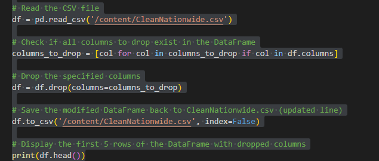
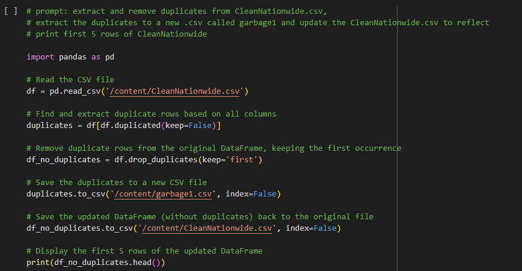
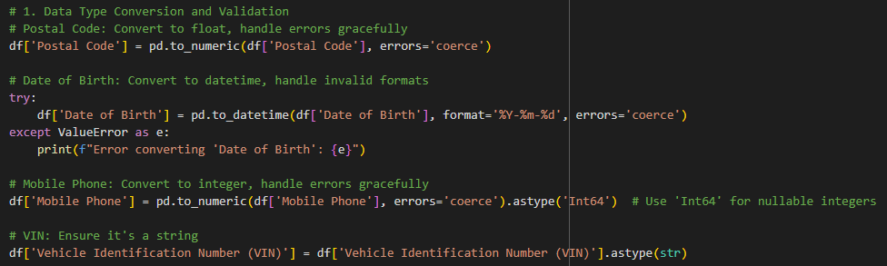
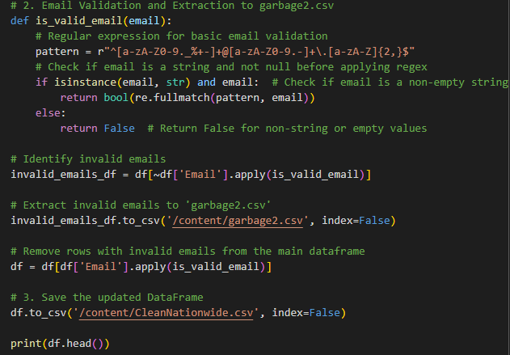
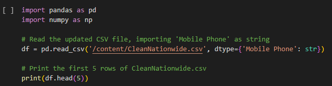
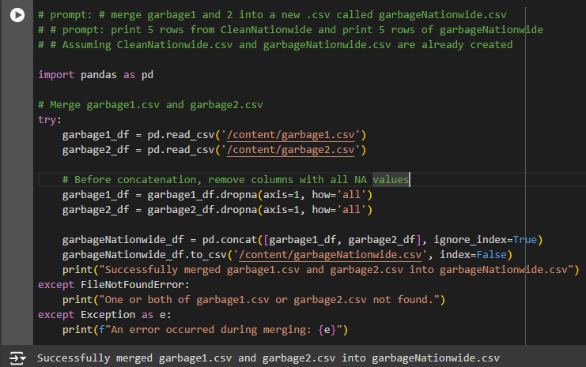
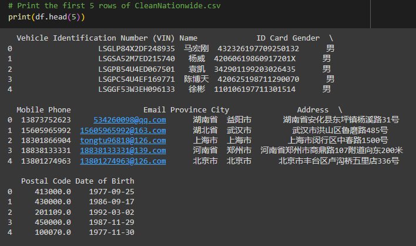

# nationwide_Alpha

# ReadMe

This script cleans Chinese car owner data. It translates column names, removes duplicates and irrelevant data, validates and formats key fields (like emails and phone numbers), creating a refined dataset for analysis.

# Chinese Car Owners Data Cleaning Project

This project cleans and processes a dataset of Chinese car owners.

# Workflow

1. **Data Loading and Translation:**
   - The script starts by loading the raw data from `760k-Car-Owners-Nationwide-China-csv-2020.csv`.
   - It then translates the Chinese column names to English using a translation dictionary.
   - The translated data is saved to a new file named `CleanNationwide.csv`.

2. **Data Cleaning and Transformation:**
   - Unnecessary columns are dropped from the DataFrame.
   - Duplicate rows are identified and removed, with the duplicates saved to `garbage1.csv`.
   - Data types are validated and converted for consistency (e.g., Postal Code to float, Date of Birth to datetime).
   - Email addresses are validated, and invalid ones are extracted to `garbage2.csv`.
   - The cleaned DataFrame is saved back to `CleanNationwide.csv`.

3. **Garbage Data Consolidation:**
   - The `garbage1.csv` and `garbage2.csv` files are merged into a single file named `garbageNationwide.csv`.

# Files

- `760k-Car-Owners-Nationwide-China-csv-2020.csv`: The original raw data file.
- `CleanNationwide.csv`: The cleaned and processed data file.
- `garbage1.csv`: Contains duplicate rows removed during cleaning.
- `garbage2.csv`: Contains rows with invalid email addresses.
- `garbageNationwide.csv`: Contains the merged data from `garbage1.csv` and `garbage2.csv`.

# Usage

To run the data cleaning process, execute the Python script in a Google Colab environment. Make sure the original data file (`760k-Car-Owners-Nationwide-China-csv-2020.csv`) is accessible in the Colab environment.

# Notes

- The script uses the pandas library for data manipulation.
- The regular expression for email validation is basic and might not cover all valid email formats.

# Code
import pandas as pd

#Define the translation dictionary
translation_dict = {
    "车架号": "Vehicle Identification Number (VIN)",
    "姓名": "Name",
    "身份证": "ID Card",
    "性别": "Gender",
    "手机": "Mobile Phone",
    "邮箱": "Email",
    "省": "Province",
    "城市": "City",
    "地址": "Address",
    "邮编": "Postal Code",
    "生日": "Date of Birth",
    "行业": "Industry",
    "月薪": "Monthly Salary",
    "婚姻": "Marital Status",
    "教育": "Education",
    "BRAND": "Brand",
    "车系": "Vehicle Series",
    "车型": "Vehicle Model",
    "配置": "Configuration",
    "颜色": "Color",
    "发动机号": "Engine Number"
}

#File path
file_path = "/content/760k-Car-Owners-Nationwide-China-csv-2020.csv"

#prompt: using the file CleanNationwide.csv "  apply the code columns_to_drop = [
#"行业": "Industry",
#"月薪": "Monthly Salary",
#"婚姻": "Marital Status",
#"教育": "Education",
#"BRAND": "Brand",
#"车系": "Vehicle Series",
#"车型": "Vehicle Model",
#"配置": "Configuration",
#"颜色": "Color",
#"发动机号": "Engine Number".
#'Unnamed: 21'

#extract the columns and place in a new csv dropColumns.csv and update "/content/CleanNationwide.csv print first 5 rows of CleanNationwide.csv with dropped columns

import pandas as pd

#Columns to drop
columns_to_drop = [
    "Industry",
    "Monthly Salary",
    "Marital Status",
    "Education",
    "Brand",
    "Vehicle Series",
    "Vehicle Model",
    "Configuration",
    "Color",
    "Engine Number",
    'Unnamed: 21'
]

#Read the CSV file
df = pd.read_csv('/content/CleanNationwide.csv')

#Check if all columns to drop exist in the DataFrame
columns_to_drop = [col for col in columns_to_drop if col in df.columns]

#Drop the specified columns
df = df.drop(columns=columns_to_drop)

#Save the modified DataFrame back to CleanNationwide.csv (updated line)
df.to_csv('/content/CleanNationwide.csv', index=False)

#Display the first 5 rows of the DataFrame with dropped columns
print(df.head())

#prompt: using the file CleanNationwide.csv" ensure the columns are as follow

#Postal Code float

#Date of Birth yyyy-mm-dd

#Mobile Phone Int

#VIN String

#check Email for invalid email adresses and extract entire column to garbage2.csv

#keep all other data as is

#update the CleanNationwide.csv file

import pandas as pd
import re

#Load the updated CSV file
df = pd.read_csv('/content/CleanNationwide.csv')

# Preview Snippet of Dataset
Dataset Preview

Here’s a glimpse of the dataset after the cleaning process. This preview showcases the expected structure and quality of the data, highlighting the improvements made:

Uniformity: Data entries are now consistent and standardized.
Completeness: All missing values have been addressed.
Accuracy: Outliers and errors have been corrected.
Readiness: The dataset is now primed for detailed analysis

